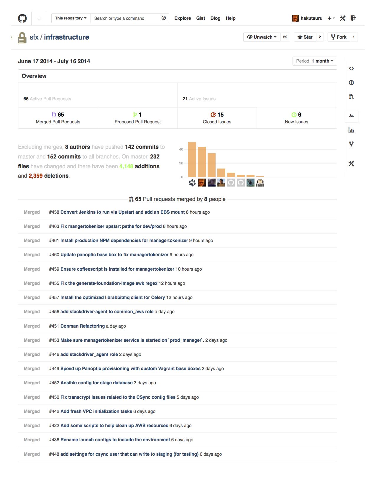

GitHub Metaphysics
==================

What is GitHub?

Sometimes it seems those using the site do not get it. GitHub is a blog engine built with git integration -- which is simple in concept, and entirely brilliant.

I feel fortunate to have been working with GitHub for several years. When I started working with SFX/Beatport, we attempted to manage our work via GitHub, and it felt as though we were very productive.

But changes in management often mean you must adopt some process or another, and even prove yourself -- *what have you done for me, lately?* (now endure every permutation of emphasis). I thought it was cool when we tried to use ZenHub, because I like kanban. But then, we were supposed to use value statements as the titles of GitHub issues, which made the boards annoying and mostly useless visually.

And that is the segue, what *this* is about... Looking at GitHub without being logged in, it seems like I do *nothing*. The *visual* difference does not feel right.

Considering roles change, and the world revolves, I wish to keep scenes of GitHub things past *for remembrance*.

2015 Beatport Pro & etc.
------------------------

Screen captures of hakutsuru account after being primary support for Beatport Pro (and later, supporting several teams deploying applications on AWS).

**One more, then there were 2^10**

2014 SFX-Arc90 Infrastructure
-----------------------------

In 2014, we had a capable, experienced CTO who thought teams should run their own stack. For many teams, this was a welcome change, but for others, it made support awkward. Before this change, we had one repo with documentation, provisioning and continuous delivery of immutable architecture -- our own *devops utopia*  {{ wry emoji }}.

It was a great privilege to work with elasticdog (and others).

